# Modelling the COVID-19 outbreak in Sri Lanka with Ordinary Differential Equations and Machine Learning

[octave-5.1.0]  
Originally Published On:  17/03/2020  
Last Updated On:          20/03/2020  

## Introduction

COVID-19 or 2019-nCoV is a novel (not seen before) coronavirus believed to be transferred to humans through bats. An outbreak of pneumonia of unknown reason was first reported on 31st December 2019 from Wuhan City in Hubei Province of China. On 7th Jan 2020, it was diagnosed as “Novel Corona Virus”. On 30th Jan 2020, World Health Organization has declared it as a Public Health Emergency of International Concern (PHEIC). On 11/02/2020 the WHO has introduced a short form for the diseases as COVID-19 and on 11/03/2020 declared as **pandemic**. (source: http://www.epid.gov.lk/)
An alarming number of cases have been reported within the first week of the outbreak in Sri Lanka and many of the reported cases have been imported directly from Italy where the disease has its second-highest number of reported cases. 

The readme file of this repository has been divided into three parts.
  1. How to model an epidemic disease using ordinary differential equations.
  2. Modelling the current situation in Sri Lanka. (Will be updated routinely until the epidemic situation diminishes)
  3. Discussion. (Will be updated routinely until the epidemic situation diminishes)

**What is discussed in this repository is solely the author's point of view and the information may be different from the real situation.**

**All the data has been copied directly from the website of Epidemiology Unit of the Ministry of Health, Sri Lanka (http://www.epid.gov.lk/).**

## 1. How to model an epidemic disease using ordinary differential equations.

Epidemic diseases can be modelled using ordinary differential equations in several ways. The most common model is the **SIR** model. It assumes that the population size is fixed (i.e., no births, deaths due to disease, or deaths by natural causes), incubation period of the infectious agent is instantaneous, and duration of infectivity is same as length of the disease. It also assumes a completely homogeneous population with no age, spatial, or social structure.

 Image: Wikipedia

The total population is believed to be a constant as epidemics tend to have shorter time frames and thus the population variation can be negligible. This total population is then divided into three parts.
  1. Susceptibles - *S(t)*
  2. Infectives   - *I(t)*
  3. Recovered or Reduced      - *R(t)*
  
  The susceptibles are the fraction of population who are susceptible to the disease. In our case, the total population is susceptible with no age, gender or social differences. 
  The infectives are the fraction of population who are know to be confirmed **active** cases of COVID-19. 
  The reduced people, in this case, are the people who have recovered from or perished due to the disease. 
  Note that *S(t), I(t), R(t)* vary with time.
  
  
  
  #### *S(t)*
  
 In the case of an epidemic, the susceptible number of people drops at any given time. This is due to people falling sick. For the disease to spread a person from the infected group *I(t)* must come in contact with a person from the susceptible group *S(t)*. Thus the rate of susceptible people falling sick is proportional to *I(t)* and *S(t)*. It is also proportional to some proportionality constant    called the transmission coefficient. Now the rate of change of *S(t)* is given by,   
 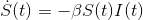   
 But, the dimensions of the rate of change of Susceptibles with time should be *people/time*. Therefore, to match the dimensions this rate should be divided by *N*, the total population. Note the minus sign is to imply the number of susceptibles drop over time.   
 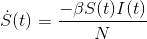   
 
 
 
  #### *I(t)*
  
  In an epidemic, the number of infectives rise up exponentially and then rises linearly for a while before coming to a maximum while exhibiting logarithmic rise. Afterwards, the infectives decay to zero. Refer the image at the bottom of the section. The rate of change of *I(t)* is governed by two factors, the rate of susceptibles turning into infectives and the rate of infectives turning into recovered or simply, dying. 
  The rate of infectives turning into reduced group solely depends on the number of infectives and hence it is proportional to *I(t)* along with a proportionality constant  called the recovery rate. Now the rate of change of infectives is given by,
  
  
  
  
  
  #### *R(t)*
  
  The rate of recovery can be extracted from the above equation to be,
  
  
  
  Note that the sum of *S(t) + I(t) + R(t)* is *N*.
  
  And the sum 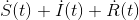 is *0*.
  
  This means that the rate of change of *N*, population, with time is zero. The population is constant. (The reason behind assuming the population to be constant is because epidemics emerge and decay in a short time span and the population change is unnoticeable).
  
  By studying these 3 ordinary differential equations one can analyze and predict the future events of an epidemic. This system of quations is nonlinear and by solving the resultant functions *S(t), I(t), R(t)* can be plotted as below (minimum noise conditions),
  
   Image: ResearchGate
  
  
  
  
  
  
  ## 2. Modelling the current situation in Sri Lanka.
  
  
  The above **system of nonlinear ordinary differential equations** can be used to model the current situation of the COVID-19 outbreak in Sri Lanka. Here are the 3 equations again,
  
  
  
  
  
  

The most important out of these three is the second equation because it deals with the rate of change of infectives.

 

The total infective and reduced population in Sri Lanka is negligible compared to the susceptible population. Hence we can safely assume that *S(t) = N*. 

Now the equation reduces to,

 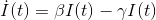
 
 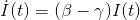
 
 It is visible that the rate of change of infectives at any given moment is proportional to the present number of infectives.
 This discussion is continued after the following section.
 
 ### How does *I(t)* behave?
 
  
 Now it is important to pause for some time and pay attention to how *I(t)* behave in an epidemic situation. It was revealed earlier, by solving the system of nonlinear ordinary differential equations, *I(t)* behaves similar to a Boltzmann curve. The first half of the curve is a logistic curve. 
 
 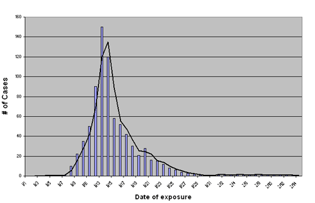 Image: Epiville
 
 This trend is also visible by studying the plots of active cases in China and South Korea. 
 
 It is worthwhile to explore some properties of a Maxwell-Boltzmann (or normal distribution) curve. This curve exhibits logistic nature in the first half.
 
 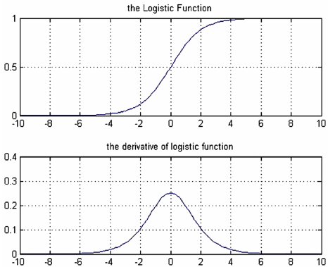 Image: ResearchGate
 
 In the beginning, the gradient of the curve rises up to some point where the gradient becomes instantaneously constant and at this point the graph instantaneously becomes linear. Next, the gradient gradually starts decreasing to zero. **We are only interested in this first-half of *I(t)* for now because the threat of the pandemic situation diminishes when *I(t)* reach the top of this logistic curve. Reaching the top of the logistic curve means that the number of active cases has reached its peak and now the active cases are beginning to drop.**
 
 ### Back to modelling the situation in Sri Lanka
 
According to the current situation in Sri Lanka it was revealed earlier that the gradient of *I(t)* behaves according to,

Which is linear.

Using a simple Machine learning (Linear regression) algorithm an approximate value for 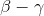 can be found. This value should be 0 for *I(t)* to reach its peak. When  < 0, *I(t)* starts decreasing.
 
 Similarly by running a similar algorithm on,
 
 
 
  can be found. 
 
 ## Current situation as of 20/03/2020  15:00 HRS
 
 ### Plot of total confirmed cases in Sri Lanka
 
  
  
 
 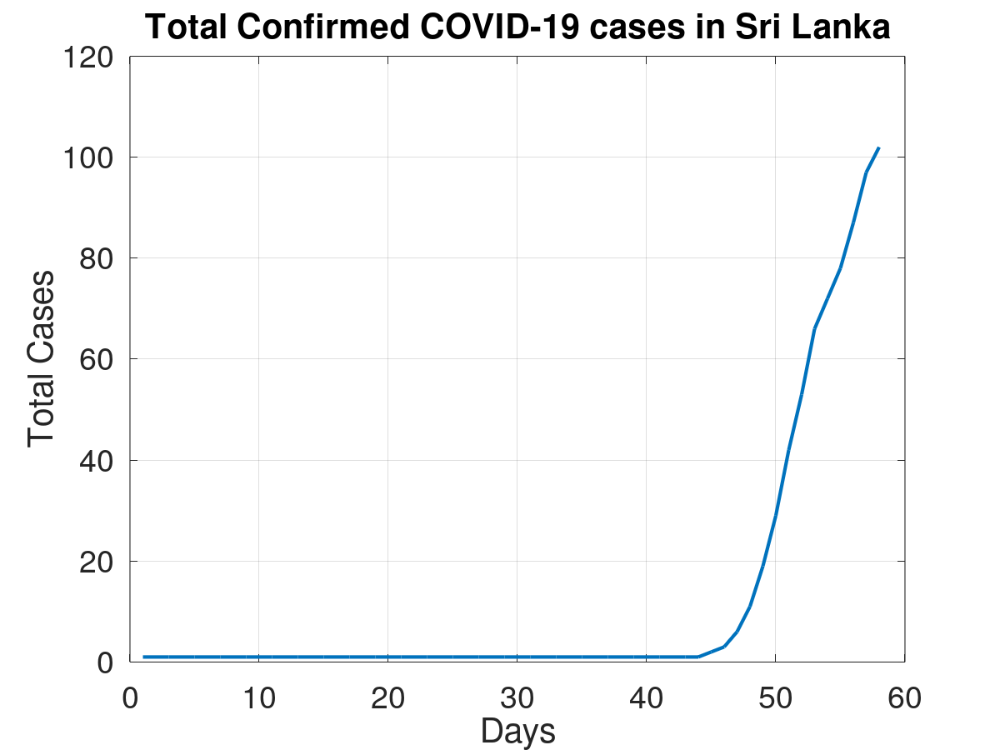
  
  
  
  
 
 ### Plot of active cases in Sri Lanka
 
  
  
 
 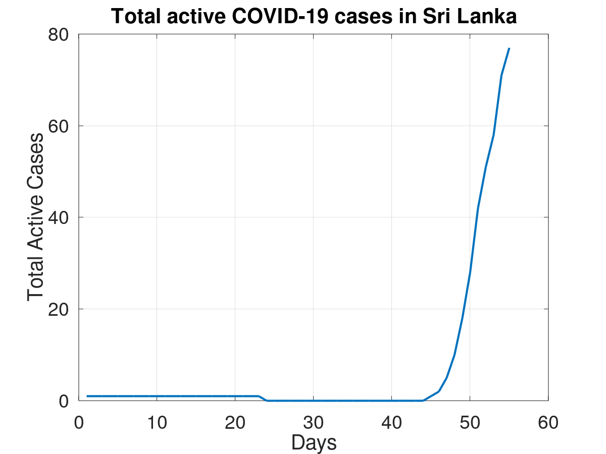
  
  
  
  
 
 ### Plot of new cases in Sri Lanka
 
  
  
 
 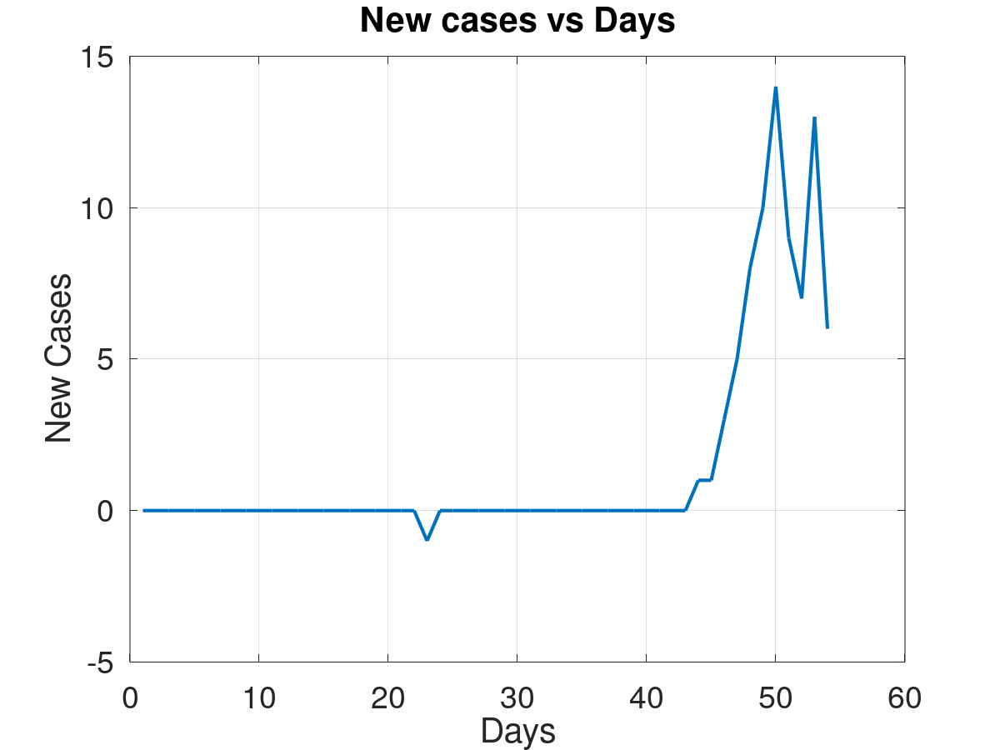
  
  
  
  
 
 ###  Plot of New cases vs Active cases with best fit curve
 
  
  
 
 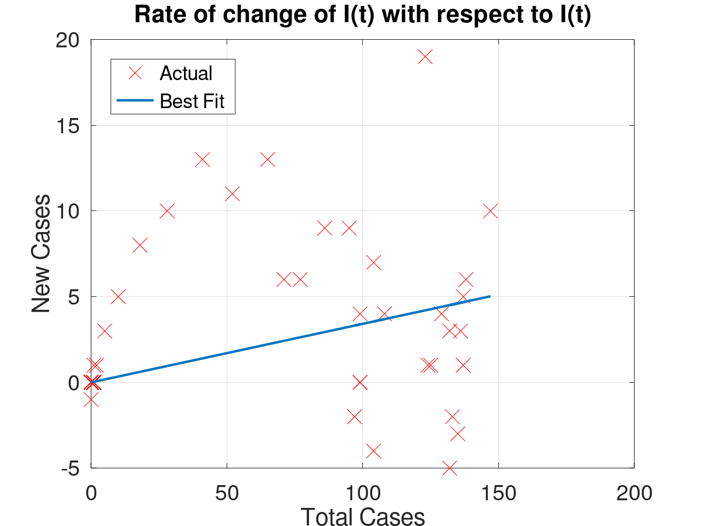
 
 ####  = **0.180048**
 
  
  
  
  
 
 ### Plot of recovered cases in Sri Lanka
 
  
  
 
 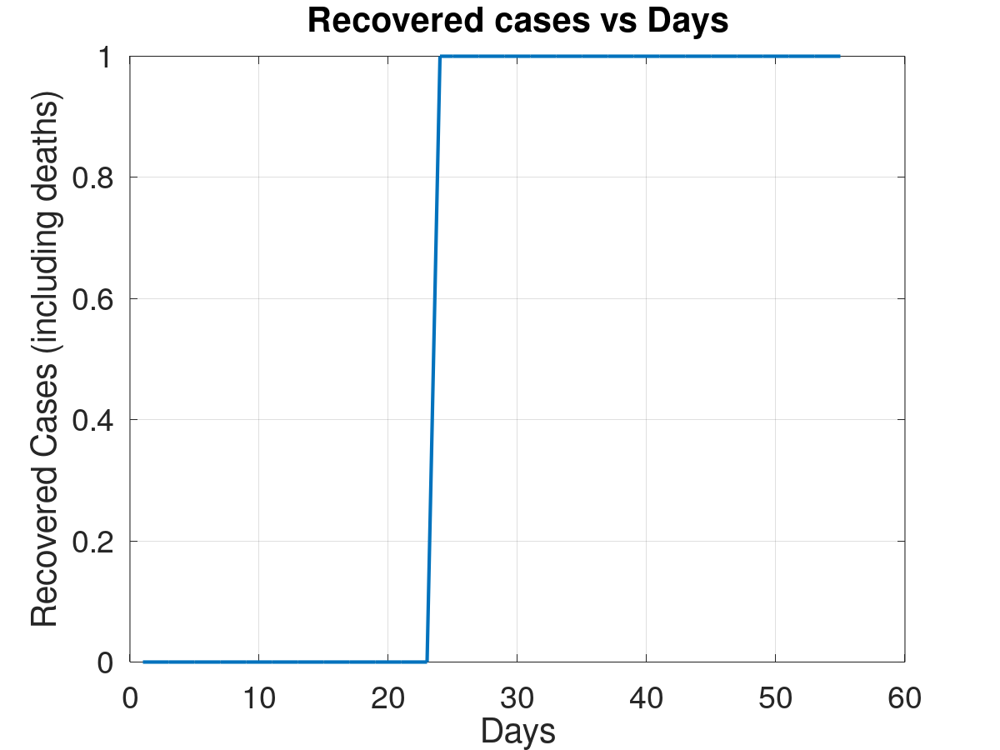
  
  
  
  
 
 ### Plot of 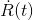 vs *I(t)* with best fit curve
 
  
  
 
 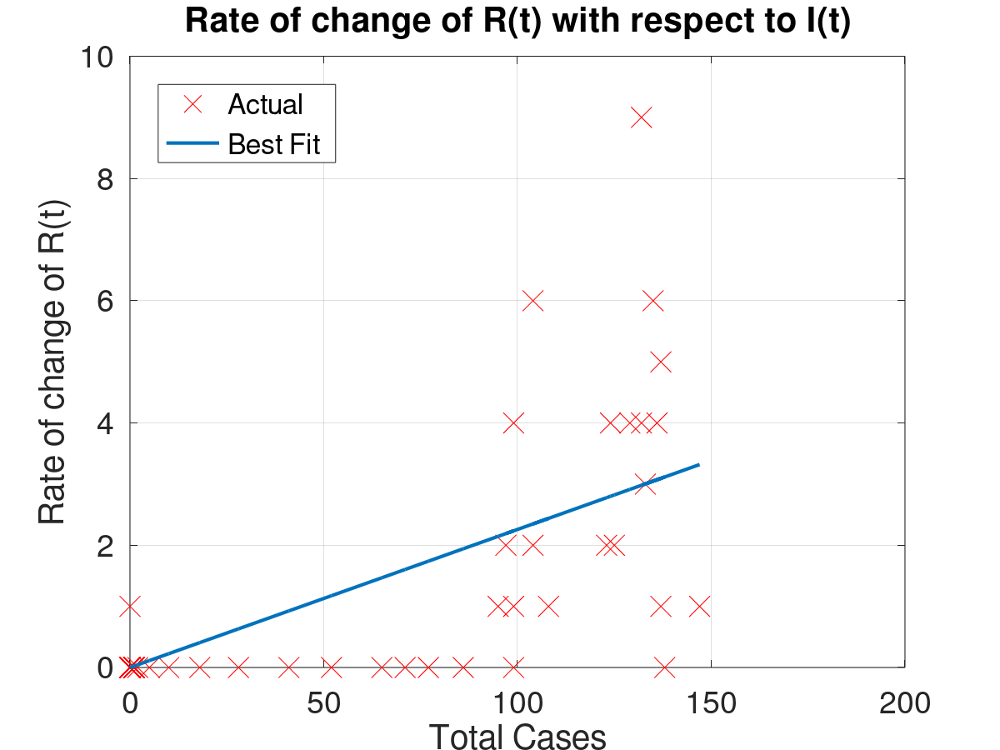
 
 ####  = **0.007821**
 
  
  
  
  
  
  
  ## 3. Discussion.
  
  
 The   value is **0.180048**. And since its above 0 more cases are expected in the future.
  
 According to the above data,
 
  =    **0.18787**  
  =   **0.007821**
 
 In the field of epidemiology the quantity 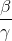 is known as the Basic reproduction number (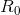.
 
 = the number of cases one case generates on average over the course of its infectious period, in an otherwise uninfected or not immune. Ref: European Respiratory Society- www.ersnet.org
 
 
 As of today,
  = **24.021**

**The basic reproduction number is important in analyzing any pandemic/ epidemic situation. The goal of epidemiologists is to bring down this number below 1. When this number is below one an infected person is less likely to spread the disease to another person over the course of his infectious period.**

By bringing down the basic reproduction number, the total number of infected individuals can be dropped significantly.

To decrease the basic reproduction number it is neccessary to decrease  (transmission coefficient) and increase  (recovery rate)

### Decreasing the transmission coefficient

Transmission coefficient depends on the following factors. It can be thought of as proportional to the product of the following quantities. 

1. Exposed duration
2. Opportunity
3. Transmission probability
4. Susceptibility

**Exposed duration**

If a person infected with COVID-19 is exposed to the community (susceptibles) for a prolonged period he is more likely to spread the disease to another person. This increases the transmission coefficient which in turn increase the basic reproduction number. Therefore, it is vital for individuals to report to medical professionals and get quarantined as soon as symptoms start to occur.

**Opportunity**

Opportunity is the likelihood of an infected person to come in contact with a susceptible person. It is good to practice social distancing to keep this quantity low. Also, a "lockdown" can decrease this quantity drastically.

**Transmission probability**

Transmission probability is the probability of the virus to transmit from the infective to the susceptible person. This quantity can be kept low by wearing protective face masks and by washing hands regularly. By practising good personal hygiene habits the probability of the virus getting transmitted across can be reduced.

**Susceptibility**

Susceptibility is the probability of a person catching the disease once the virus enters his body. A strong immune system can act up against the virus. Developing a vaccine to protect people from this virus can immensely help in bringing down susceptibility. 

### Increasing the recovery rate

General public have almost no control over this. The only possible way to increase the recovery rate is to develop effective medicine to heal the patients. Also, this quantity automatically rises when more and more people are dying.

## An additional method to predict when will the epidemic slow down

The total number of reported cases (not the total active cases) exhibits a logistic nature. 

The gradient of total cases increases at first stays constant for a brief period and then decreases as the epidemic comes to an end.

The point at which the gradient stays constant is the inflexion point of the graph. After this point, the gradient drops and the new cases being reported each day will decrease. 

This inflexion point can be found by dividing consecutive gradient values. As the graph reaches its inflexion point, the gradient becomes a constant and the ratio between two consecutive gradient values becomes closer to one. This ratio is called the growth factor. As the growth factor reaches 1, the epidemic begins to diminish. By further observation, it is clear that roughly two times the number of infectives at the inflexion point becomes infected at the end of the epidemic. 

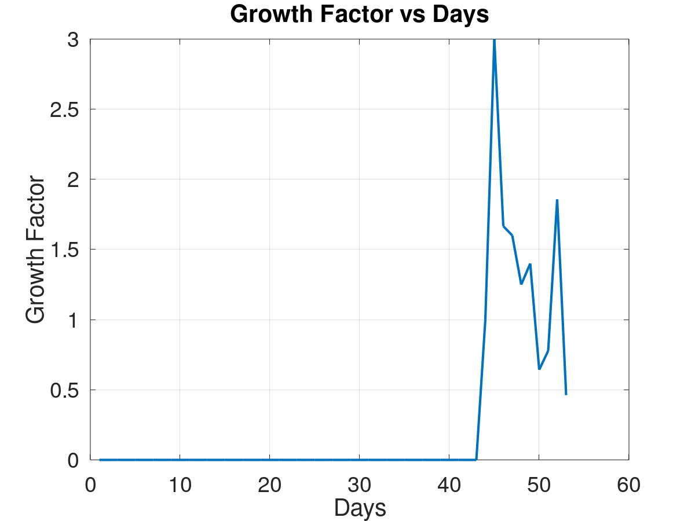

***All the predictions and comments are based on the imformation publicly available on http://www.epid.gov.lk. Octave codes used to model the current COVID-19 outbreak in Sri Lanka are avalable in this repository.***

## References

[1] : Kermack-McKendrick Model  
        https://mathworld.wolfram.com/Kermack-McKendrickModel.html
       
[2] : The Coronavirus, by the Numbers   
        https://www.nytimes.com/2020/03/05/health/coronavirus-deaths-rates.html
        
[3] : Modelling Epidemics  
        https://jvanderw.une.edu.au/L5_ModellingEpidemics1.pdf
        
[4] : Exponential growth and epidemics  
        https://www.youtube.com/watch?v=Kas0tIxDvrg
        
[5] : Epidemiology Unit ,Ministry of Health & Indigenous Medical Services, Sri Lanka  
        http://www.epid.gov.lk

 
 
 
 

Ranitha Mataraarachchi,  
Room No: 2234,  
Akbar-Nell Hall,  
Faculty of Engineering,  
University of Peradeniya,  
Peradeniya, Sri Lanka.

(+94)777722662  
ranitha@ieee.org  
[Facebook](https://www.facebook.com/1994ranitha) | [LinkedIn](https://www.linkedin.com/in/ranitha/)
